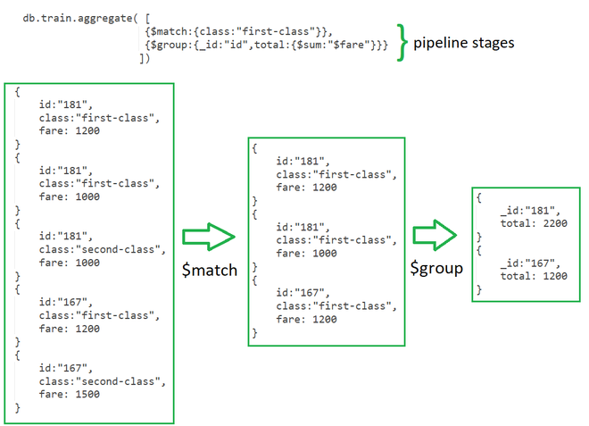

# Aggregation in MongoDB

In MongoDB, aggregation operations process the data records/documents and return computed results. It collects values from various documents and groups them together and then performs different types of operations on that grouped data like sum, average, minimum, maximum, etc to return a computed result. It is similar to the aggregate function of SQL.

### MongoDB provides three ways to perform aggregation

- Aggregation pipeline
- Map-reduce function
- Single-purpose aggregation

## Aggregation pipeline

In MongoDB, the aggregation pipeline consists of stages and each stage transforms the document. Or in other words, the aggregation pipeline is a multi-stage pipeline, so in each state, the documents taken as input and produce the resultant set of documents now in the next stage(id available) the resultant documents taken as input and produce output, this process is going on till the last stage. The basic pipeline stages provide filters that will perform like queries and the document transformation modifies the resultant document and the other pipeline provides tools for grouping and sorting documents. You can also use the aggregation pipeline in sharded collection.

## Let us discuss the aggregation pipeline with the help of an example:



### **Stages** : Each stage starts from stage operators which are:

- **$match**: It is used for filtering the documents can reduce the amount of documents that are given as input to the next stage.
- **$project** : It is used to select some specific fields from a collection.
- **$group** : It is used to group documents based on some value.
- **$sort** : It is used to sort the document that is rearranging them
- **$skip** : It is used to skip n number of documents and passes the remaining documents
- **$limit** : It is used to pass first n number of documents thus limiting them.
- **$unwind** : It is used to unwind documents that are using arrays i.e. it deconstructs an array field in the documents to return documents for each element.
- **$out** : It is used to write resulting documents to a new collection

**Expressions** : It refers to the name of the field in input documents for e.g. { $group : { _id : “**$id**“, total:{$sum:”**$fare**“}}} here **$id** and **$fareee\*\* are expressions.

**Accumulators**: These are basically used in the group stage

- **sum** : It sums numeric values for the documents in each group
- **count** : It counts total numbers of documents
- **avg** : It calculates the average of all given values from all documents
- **min** : It gets the minimum value from all the documents
- **max** : It gets the maximum value from all the documents
- **first** : It gets the first document from the grouping
- **last** : It gets the last document from the grouping

## Example

```
{
   _id: ObjectId(7df78ad8902c)
   title: 'MongoDB Overview',
   description: 'MongoDB is no sql database',
   by_user: 'tutorials point',
   url: 'http://www.tutorialspoint.com',
   tags: ['mongodb', 'database', 'NoSQL'],
   likes: 100
},
{
   _id: ObjectId(7df78ad8902d)
   title: 'NoSQL Overview',
   description: 'No sql database is very fast',
   by_user: 'tutorials point',
   url: 'http://www.tutorialspoint.com',
   tags: ['mongodb', 'database', 'NoSQL'],
   likes: 10
},
{
   _id: ObjectId(7df78ad8902e)
   title: 'Neo4j Overview',
   description: 'Neo4j is no sql database',
   by_user: 'Neo4j',
   url: 'http://www.neo4j.com',
   tags: ['neo4j', 'database', 'NoSQL'],
   likes: 750
},
```

Now from the above collection, if you want to display a list stating how many tutorials are written by each user, then you will use the following **aggregate()** method −

```
db.mycol.aggregate([{$group : {_id : "$by_user", num_tutorial : {$sum : 1}}}])
{ "_id" : "tutorials point", "num_tutorial" : 2 }
{ "_id" : "Neo4j", "num_tutorial" : 1 }
```

_In the above example, we have grouped documents by field by_user and on each occurrence of by user previous value of sum is incremente_

[Refrence](https://www.geeksforgeeks.org/aggregation-in-mongodb/)
